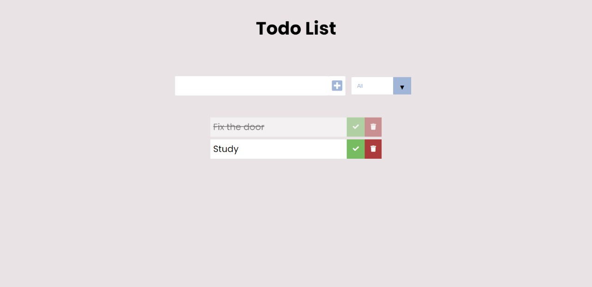

# Todo List Vanilla JS.
## :book: About
Todo list created using vanilla JS. In this project, you can create new tasks, delete and mark tasks as finished. Also, the tasks will be saved on local storage

## :rocket: Main technologies:
* Javascript
* HTML
* CSS

## :gear: Funcionalities
- [x] Save tasks.
- [x] Mark tasks as finished.
- [x] Filter tasks by all, completed and uncompleted.
- [x] Save the tasks on local storage

## :computer: Layout


## :electric_plug: Running the project

```bash
  # Clone the repository.
  $ git clone https://github.com/phb2000/TodoListJS.git
```

Now you can open the index.html file.


